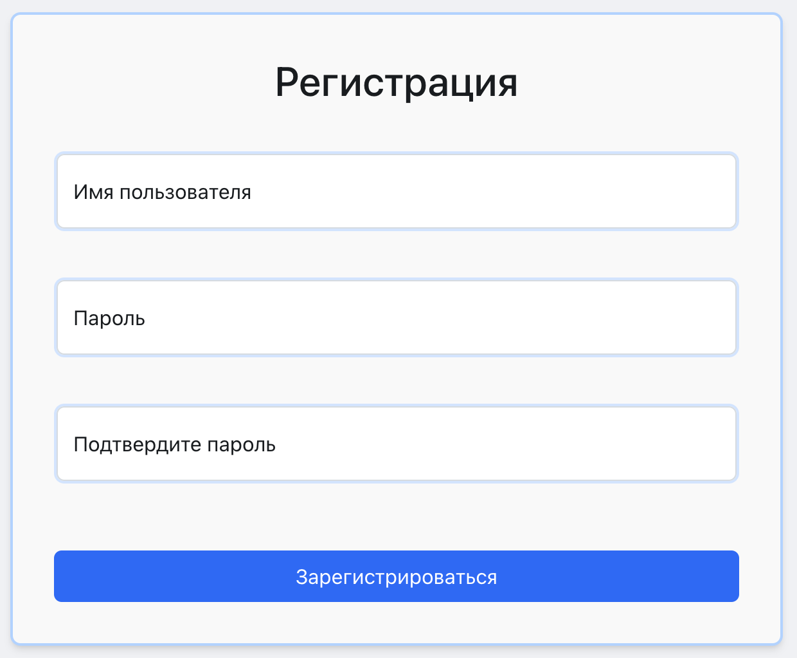

# [Chat Slack](https://dianashilova.github.io/frontend-project-12-vite/login)

[](https://github.com/DianaShilova/frontend-project-12/actions)
[](https://codeclimate.com/github/DianaShilova/frontend-project-12/maintainability)

This project is a simple analog of Slack. You can create a new user in registration page or login with previously created login and password.


The chat have animation command: **'/love'**, **'/fire'**, **'/firework'**, **'/snow'**, **'/confetti'**, **'/laugh'**. Just write this command in input and send it to the chat.

## Getting started

**_To install the required dependencies:_**

```
cd client
npm install
```

**_To run a project(client & server) locally:_**

```
cd server
npm run start-dev
```

**_To run the client locally:_**

```
cd client
npm run dev
```

**_To run the server locally:_**

```
cd server
npm run start
```
