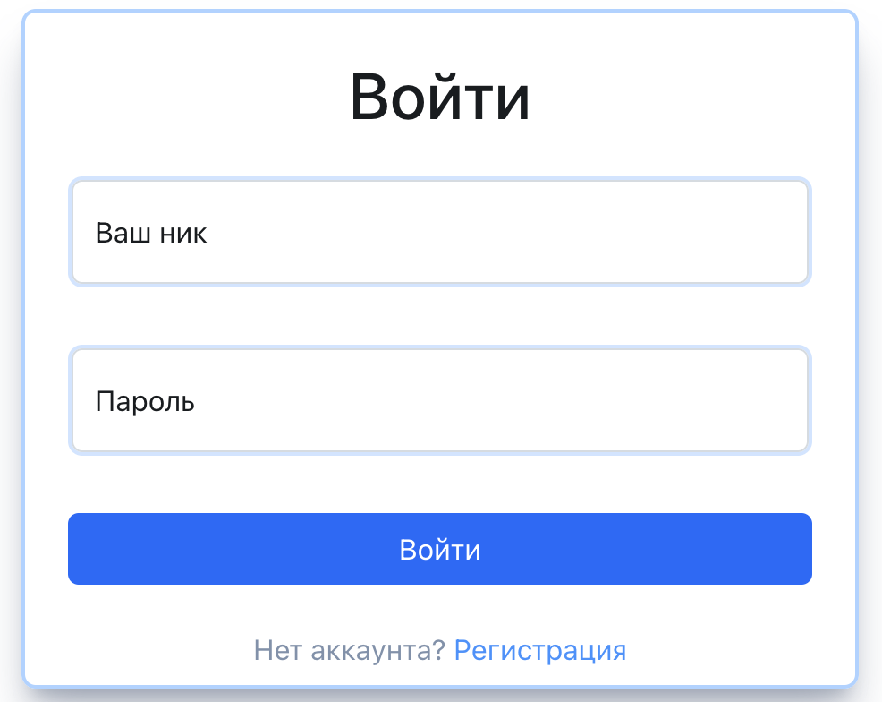
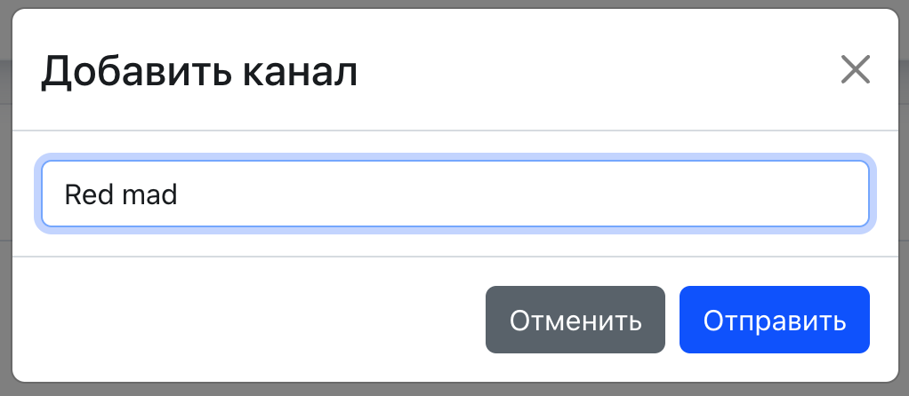
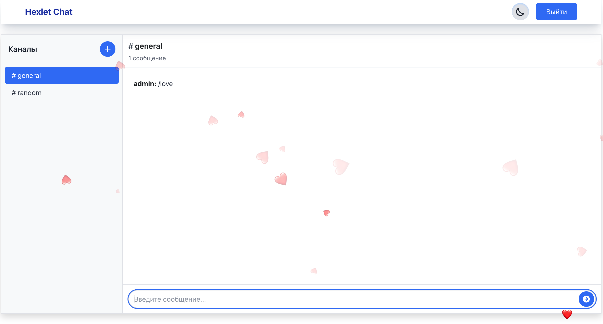
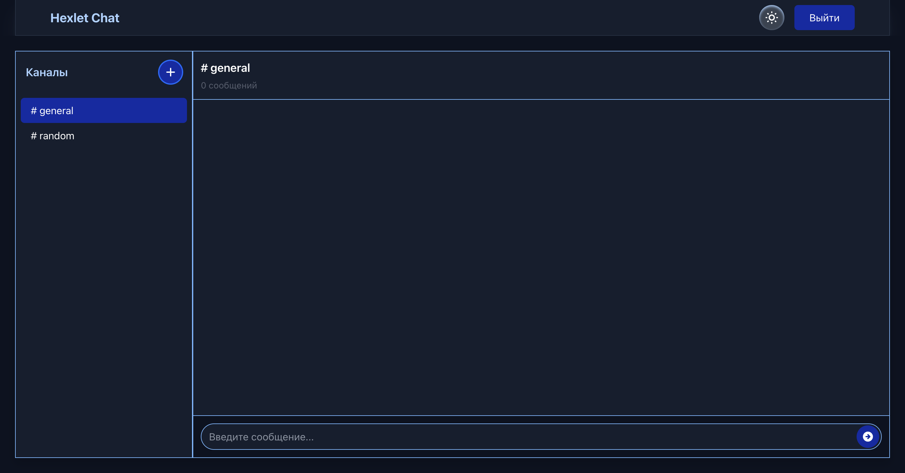

# [Chat Slack](https://dianashilova.github.io/frontend-project-12-vite/login)

[](https://github.com/DianaShilova/frontend-project-12/actions)
[](https://codeclimate.com/github/DianaShilova/frontend-project-12/maintainability)

This project is a simple analog of Slack. Chat was created for user communication.

Log in or create a new user and start communicating. You can create/edit/delete your own channels and chat in them. Use emoji animation to express your emotions.

## Library

**[Redux Toolkit](https://redux-toolkit.js.org/)** - helps manage state.  
**[Bootstrap](https://getbootstrap.com/)** - source for the creation of websites and web apps.  
**[Formik](https://formik.org/)** - solves three main tasks when creating forms: Managing the state of the form, Validating and Submitting.  
**[i18next](https://www.i18next.com/)** - dictionary of words.  
**[Socket.io-client](https://socket.io/)** - enables low-latency, bidirectional and event-based communication between a client and a server.  
**[TypeScript](https://www.typescriptlang.org/docs/)** - a syntactic superset of JavaScript which adds static typing.  
**[Eslint](https://eslint.org/docs/latest/use/migrate-to-8.0.0)** - checks JavaScript code for common problems.  
**[Husky](https://typicode.github.io/husky/)** - helps work with Git hooks more efficiently and run all the scripts that need to work at various stages.  
**[Vite](https://vitejs.dev/)** - Vite is a tool for building fast and optimized web applications.  
**[Tailwindcss](https://tailwindcss.com/)** - for working with CSS styles, dark and light theme styling.

## Using

You can create a new user in registration page or login with previously created login and password.

Create a new channel or go to previously created channel.

You can also change the name of all channels (except General and Random), but remember that filtering of obscene words is used.  
The chat have animation command: **'/love'**, **'/fire'**, **'/firework'**, **'/snow'**, **'/confetti'**, **'/laugh'**. Just write this command in input and send it to the chat.

In the last update was added dark them style. Can be used on the any page.


## Getting started

**_To install the required dependencies:_**

```
cd client
npm install
```

**_To run a project(client & server) locally:_**

```
cd server
npm run start-dev
```

**_To run the client locally:_**

```
cd client
npm run dev
```

**_To run the server locally:_**

```
cd server
npm run start
```

**_To check for cods errors_**

```
npm run lint .
```
